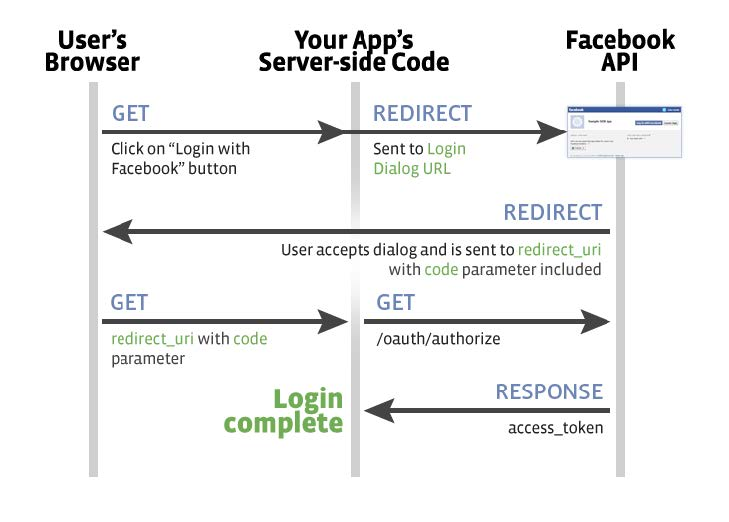

# 十三、子域劫持

> 作者：Peter Yaworski

> 译者：[飞龙](https://github.com/)

> 协议：[CC BY-NC-SA 4.0](http://creativecommons.org/licenses/by-nc-sa/4.0/)

## 描述

子域控制就真的是听上去那样，它是一种场景，恶意用户能够代表合法站点来证明一个子域。总之，这一类型的漏洞涉及站点为子域创建 DNS 记录，例如，Heroku（主机商）

1.  `example.com`在Heroku 上注册。

2.  `example.com`创建 DNS 记录`subdomain.example.com`，指向`unicorn457.heroku.com`。

3.  `example.com`没有申请`unicorn457.heroku.com `。

4.  恶意用户申请了`unicorn457.heroku.com `，并复制了`example.com`。

5.  所有`subdomain.example.com`的流量都会刘静恶意网站，它看上去类似`example.com`。

所以，按照这个逻辑，需要取消外部链接的 DNS 条目，例如 Heroku，Github 和 Amazon S3。发现它们的一个不错的方法是使用 KnockPy，它会在工具一节中讨论，它迭代了子域的常见列表来验证是否存在。

## 示例

1\. Ubiquiti 子域劫持

难度：低

URL：`http://assets.goubiquiti.com`

报告链接：`https://hackerone.com/reports/109699`

报告日期：2016.1.10

奖金：$500

描述：

就像子域劫持的描述中所述，`http://assets.goubiquiti.com`拥有执行 Amazon S3 文件存储的 DNS 记录，但是不存在实际的 Amazon S3 容器。这里是 HackerOne 的截图：

因此，恶意用户可以申请`uwn-images.s3-website-us-west-1.amazonaws.com `，并在这里部署站点。假设它可以使其更加类似 Ubiquiti，这里的漏洞时诱使用户来提交个人信息，并控制账户。

> 重要结论

> DNS 记录提供了全新并独特的漏洞利用机会。使用KnockPy 来尝试验证子域是否存在，之后确认它们指向有效的资源，并且特别注意三方服务，例如 AWS、Github、Zendesk 以及其他。这些服务允许你注册自定的 URL。

### 2\. Scan.me 的 Zendesk 指向

难度：低

URL：`support.scan.me `

报告链接：`https://hackerone.com/reports/114134`

报告日期：2016.2.2

奖金：$1000

描述：

就像 Ubiquiti 的示例那样，这里 Scan.me 拥有一个 DNS 记录，将`support.scan.me `指向` scan.zendesk.com`。这种情况下，黑客` harry_mg `就能够申请` scan.zendesk.com`，`support.scan.me`指向了它。

就是这样了，奖金是 $1000。

> 重要结论

> 要注意！这个漏洞与 2016 年 2 月发现，并且完全不复杂。成功的漏洞挖掘需要敏锐的观察。

### 3\. Facebook 官方的访问 Token

难度：高

URL：`facebook.com`

报告链接：`http://philippeharewood.com/swiping-facebook-official-access-tokens`

报告日期：2016.2.29

奖金：未公开

描述：

我不知道这是否符合子域劫持的技术定义（如果有的话），但是我觉得这是个重大的发现，让 Philippe 能够以最少的交互劫持任意 Facebook 账户。

为了理解这个漏洞，我们需要看一看 OAuth，根据他们的站点，它是一个开放协议，能够以简单和标准的方式来验证 Web 移动和桌面应用的安全性。换句话说，OAuth 允许用户授权某个应用来代表它们，而不需要向应用分享密码。如果你曾经浏览器过某个站点，它让你使用你的 Google、Facebook、Twitter 以及其他账户来登录，你就使用了 OAuth。

现在，假设你注意到了这里的潜在利用。如果 OAuth 允许用户授权，错误实现的影响非常之大。理解了这个过程之后，Philippe 提供了一副不错的图片来解释协议是如何实现的。

Philippe Harewood - Facebook OAuth 流程

总之，我们可以在这里看到：

1.  用户通过一些 APP 请求将 Facebook API 使用一些目的。

2.  这个 APP 将用户重定向到 Facebook API 来授予权限。

3.  Facebook API 向用户提供代码并将其重定向到 APP。

4.  APP 接受代码并调用 Facebook API 来获得 Token。

5.  Facebook 返回 Token 给 APP，它代表用于为调用授权。

这个流程中，你会注意到用户在哪儿都不需要向访问它们账户的 APP 提供他们的 Facebook 用户名和密码。这也是个概览，这里也可能出现很多其他事情，包括可以在流程中交换的额外信息。

这里有一个重大漏洞，Facebook 在 #5 中向应用提供访问 Token。

再回头考虑 Philippe 的发现，它详细解释了如何尝试并捕获这些 Token，来诱使 Facebook 向他发送它们，而不是那个应用。但是，反之，它决定寻找能够控制的，存在漏洞的 Facebook 应用。

结果，