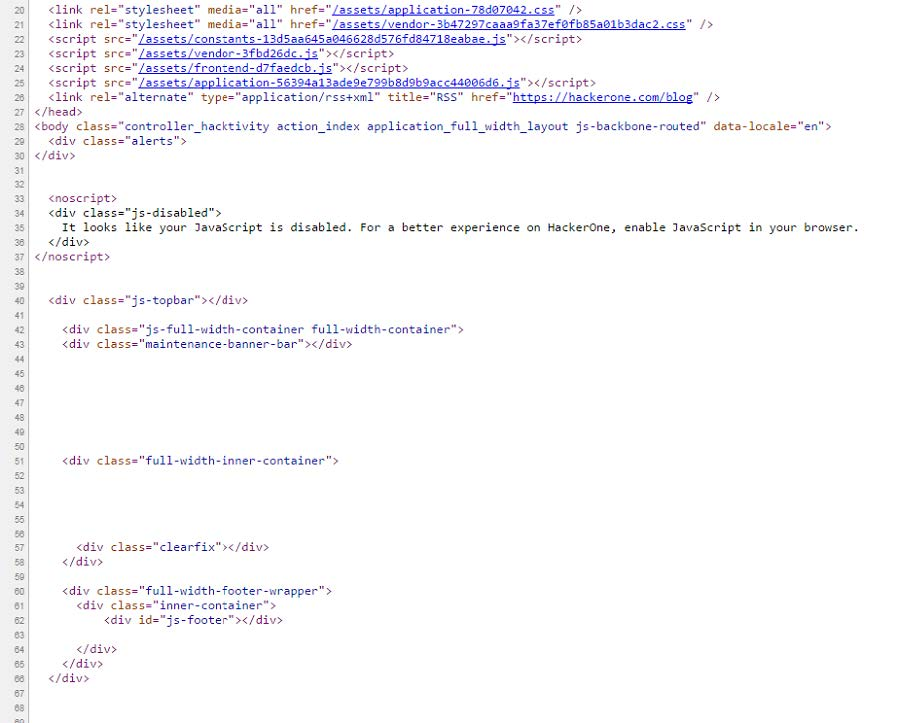
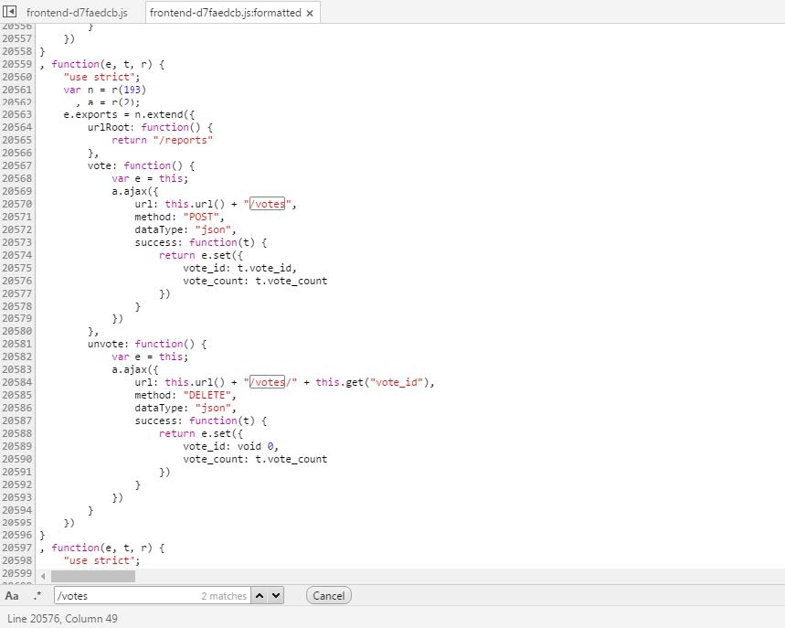

# 九、应用逻辑漏洞

> 作者：Peter Yaworski

> 译者：[飞龙](https://github.com/)

> 协议：[CC BY-NC-SA 4.0](http://creativecommons.org/licenses/by-nc-sa/4.0/)

应用逻辑漏洞不同于其他我们讨论过的类型。虽然 HTML 注入、HTML 参数污染和 XSS 都涉及到提交一些类型的潜在恶意输入，应用落地及漏洞实际上涉及到操纵场景和利用 Web APP 代码中的 Bug。

这一类型攻击的一个值得注意的例子是 Egor Homakov 对 Github 的渗透，Github 使用 RoR 编写。如果你不熟悉 Rails，他是一个非常流行的 Web 框架，在开发 Web 站点时，它可以处理很多繁杂的东西。

在 2012 年 3 月，Egor 通知了 Rails 社区，通常，Rails 会接受所有提交给它的参数，并使用这些值来更新数据库记录（取决于开发者的实现。Rails 核心开发者的想法是，使用 Rails 的 Web 开发者应该负责填补它们的安全间隙，并定义那个值能够由用户提交来更新记录。这个行为已经在社区内人人皆知了，但是 Github 上的线程展示了很少的人能够鉴别出来它带来的风险（`https://github.com/rails/rails/issues/5228`）。

当核心开发者不同意他的时候，Egor 继续利用 Github 上的认证漏洞，通过猜测和提交参数值，它包含创建日期（如果你熟悉 Rails 并且知道多数数据库记录包含创建和更新日期列，它就不太困难）。因此，它在 Github 上传了一个票据，年份是未来的某个日期。它也设法更新 SHH 访问密钥，这可以使他访问 Github 官方的代码仓库。

之前提到了，这个渗透通过 Github 后端代码实现，它并没有合理验证 Egor 所做的事情，这在随后可用于更新数据库记录。这里，Egor 发现了叫做大量赋值漏洞的东西。

应用逻辑漏洞，即发现前面讨论的这种类型的攻击，更加有技巧性，因为它们依赖代码判定的创造丁思渭，并且并不仅仅是提交潜在的恶意代码，开发者没有转义它。（不要尝试在这里简化其它类型的漏洞，一些 XSS 攻击也很复杂！）

使用 Github 的例子，Egor 知道了系统基于 Rails 以及 Rails 如何处理用户输入。在其他例子中，它涉及直接编程调用 API 来测试应用的行为，就像 Shopify 的管理员权限绕过那样。或者，它涉及重复使用来自认证 API 调用的返回值，来进行后续的API 调用，本不应该允许你这么做。

## 示例

### 1\. Shopify 管理员权限绕过

难度：低

URL：`shop.myshopify.com/admin/mobile_devices.json `

报告链接：`https://hackerone.com/reports/100938`

报告日期：2015.11.22

奖金：$500

描述：

Shopify 是一个巨大并健壮的平台，它包含 Web UI 以及受支持的 API。这个例子中，API 不验证一些权限，而 Web UI 明显会这么做。因此，商店的管理员，它们不被允许接受邮件提醒，可以通过操作 API 终端来绕过这个安全设置，在它们的 Apple 设备中收到提醒。

根据报告，黑客只需要：

+   使用完全访问权限的账号登录 Shopify 移动应用
+   拦截`POST /admin/mobile_devices.json`的请求
+   移除该账号的所有权限
+   移除添加的移动端提醒
+   重放`POST /admin/mobile_devices.json`的请求

这样做之后，用户可以接收到所有商店处的订单的移动端提醒，因此忽略了商店配置的安全设置。

> 重要结论

> 这里有两个重要结论。首先，并不是所有东西都涉及代码注入。始终记住使用代码并观察向站点传递了什么信息，并玩玩它看看什么会发生。这里，所有发生的事情是，移除 POST 参数来绕过安全检查。其次，再说一遍，不是所有攻击都基于 HTML 页面。API 终端始终是一个潜在的漏洞区域，所以确保你考虑并测试了它们。

### 2\. 星巴克竞态条件

难度：中

URL：`Starbucks.com `

报告链接：`http://sakurity.com/blog/2015/05/21/starbucks.html`

报告日期：2015.5.21

奖金：无

描述：

如果你不熟悉竞态条件，本质上它是两个潜在的进程彼此竞争来完成任务，基于一个厨师场景，它在请求被执行期间变得无效。换句话说，这是一个场景，其中你拥有两个进程，它们本应该是互斥的，不应该同时完成，但是因为它们几乎同时执行，它们被允许这么做了。

这里是一个例子：

1.  你在手机上登录进了你的银行站点，并请求将 $500 从你的一个仅仅拥有 $500 的账户转到另一个账户。

2.  这个请求花费很长时间（但是仍然处理），所以你在你的笔记本上登录，并且再次执行了相同请求。

3.  笔记本的请求几乎立即完成了，但是你的手机也是这样。

4.  你刷新了银行账户，并发现你的账户里有 $1000。这意味着请求执行了两次，这本不应被允许，因为你一开始只拥有 $500。

虽然这个很基础，理念都是一样的，一些条件存在于请求开始，在完成时，并不存在了。

所以，回到这个例子，Egor 测试了从一个星巴克的卡中转账，并且发现他成功触发了竞态条件。请求使用 CURL 程序几乎同时创建。

> 重要结论

> 竞态条件 是个有趣的攻击向量，它有时存在于应用处理一些类型的余额的地方，例如金额、积分，以及其他。发现这些漏洞并不总是发生在第一次尝试的时候，并且可能需要执行多次重复同时的请求。这里，Egor 在成功之前执行了 6 次请求。但是要记住在测试它的时候，要注意流量负荷，避免使用连续的测试请求危害到站点。

### 3\. Binary.com 权限提升

难度：低

URL：`binary.com`

报告链接：`https://hackerone.com/reports/98247`

报告日期：2015.11.14

奖金：$300

描述：

这真是一个直接的漏洞，不需要过多解析。

本质上，在这个场景下，用户能够登录任何账户，代表被黑的用户账户，并查看敏感信息，或执行操作，并且一切只需要知道用户的 UID。

在你渗透之前，如果你登录了` Binary.com/cashier`，并查看了页面的 HTML，你会注意到有个`<iframe>`标签包含 PIN 参数。这个参数实际上就是你的账户 ID。

下面，如果你编辑了 HTML，并且插入了另一个 PIN，站点就会自动在新账户上执行操作，而不验证密码或者任何其他凭据。换句话说，站点会将你看做你所提供的账户的拥有者。

同样，所需的一切就是知道某人的账户号码。你甚至可以在出现在`iframe`中的时间修改为`PAYOUT`，来触发另一个账户的付款操作。但是，`Bianry.com`表示，所有取款都需要手动人工复查，但是这并不是说，这就一定会被发现。

> 重要结论

> 如果你寻找基于漏洞的认证，要留意凭据传递给站点的地方。虽然这个漏洞通过查看页面源码来实现，你也可以在使用代理拦截器的时候，留意传递的信息。

> 如果你的确发现了被传递的一些类型的凭据，但他们看起来没有加密时，要注意了，并且尝试玩玩它们。这里，PIN 是`CRXXXXXX`而密码是`0e552ae717a1d08cb134f132`。显然 PIN 没有解密，但是密码加密了。未加密的值是一个非常好的地方，你可以从这里下手。

### 4\. HackerOne 信号操作

难度：低

URL：`hackerone.com/reports/XXXXX`

报告链接：`https://hackerone.com/reports/106305`

报告日期：2015.12.21

奖金：$500

描述：

在 2015 年年末，HackerOne 向站点进入了新的功能，叫做信号。本质上，在这些报告关闭之后，它有助于识别黑客的之前漏洞报告的有效性。重要的是要注意，用户可以关闭它们在 HackerOne 上的报告，这本应该对他们的声誉和信号功能毫无影响。

所以，你可以猜到，在测试该功能的时候，一个黑客发现了这个功能的不合理实现，并且允许黑客向任何团队创建报告，自己关闭报告，并从中受益。

这就是这里的情况了。

> 重要结论

通过一个简短的描述，这里的结论不可能全部覆盖。一定要留意新的功能！当站点实现了新的功能时，它对于黑客就像鲜肉一样。新的功能展示了测试新代码和搜索漏洞的机会。这就和 Shopify 和 Twitter 的 CSRF，以及 Facebook 的 XSS 漏洞一样。为了最大利用它们，使你自己熟悉公司，并且订阅公司的博客是个好主意，以便你在一些东西发布之后能够收到提醒。之后测试它们。

### 5\. Shopify S3 Bucket 开放

难度：中

URL：` cdn.shopify.com/assets `

报告链接：`https://hackerone.com/reports/106305`

报告日期：2015.11.9

奖金：$1000

描述：

Amazon 简易存储 S3，是一个服务，允许用户在 Amazon 的云服务器上储存和托管文件。Shopify 和许多站点都是用 S3 来储存和托管静态内容，例如图片。

Amazon Web 服务的整个套件，AWS，是非常健壮的，并包含权限管理系统，允许管理员为每个服务定义权限，包含 S3。许可包含创建 S3 Bucket 的功能（Bucket 就像储存器的文件夹），读取和写入 Bucket ，以及其他。

根据披露，Shopify 没有合理配置它们的 S3 Bucket 权限，并且无意中允许任何认证过的 AWS 用户读取或写入它们的 Bucket。这显然是由问题的，因为你至少不希望恶意的黑帽子使用你的 S3 Bucket 来储存和托管文件。

不幸的是，这个问题的细节没有暴露，但是可能使用 AWS CLI 来发现，这是一个工具，允许你和 AWS 服务在你的共领航上交互。虽然你需要一个 AWS 账户来做这个事情，创建账户实际上也是免费的，因为你不需要任何服务。因此，使用 CLI 你就可以在 AWS 上认证你自己，并且随后测试是否可以访问（这也是我发现 HackerOne Bucket 的方式，它在下面列出）。

> 重要结论

> 当你侦查一个潜在的目标时，确保注意到所有不同的工具，包含 Web 服务，它们明显可以使用。每个服务或软件，OS，以及其他。你可以寻找或发现新的攻击向量。此外，使你自己熟悉流行的 Web 工具，例如 AWS S3，Zendesk，Rails，以及其他是个好主意。许多站点都使用它们。

### 6\. HackerOne S3 Bucket 开放

难度：中

URL：`[REDACTED].s3.amazonaws.com `

报告链接：`https://hackerone.com/reports/128088`

报告日期：2016.4.3

奖金：$2500

描述：

我们打算讲一些有些不同的东西。这是一个漏洞，我实际上发现了他，并且和上面描述的 Shopify 的问题有些不同，所以我打算详细分享关于我如何发现他的任何事情。

所以，一开始，上面描述的漏洞就是，一个 Bucket 公开链接到了 Shopify。意思是，当你访问这个想点时，你会看到 AWS 服务的调用，所以黑客就知道 Bucket 指向哪里。但是我并没有 -- 我使用了一个很酷的脚本和一些工具来发现了 Bucket。

在 4 月 3 日的周末，我不知道为什么，但是我决定跳出思维定式，并尝试攻击 HackerOne。我一开始就玩了玩它们的站点，并且每次新漏洞发现时，都迫使我自己阅读信息披露，想了解为什么我错过了它。我想知道他们的 S3 Bucket 是否存在类似 Shopify 的漏洞。我也想知道，黑客如何访问了 Shopify 的 Bucket。我了解到它是通过 Amazon 命令行工具来访问的。

现在，通常我会使自己停下，因为 HackerOne 这个时候不可能还拥有漏洞。但是我突然有一个想法，它来源于我和 Ben Sadeghipour (@Nahamsec) 的访谈，就是不要怀疑自己，或者公司犯错的可能。

所以我在 Google 上搜索一些细节，并碰到了两个有意思的页面：

[There’s a Hole in 1,951 Amazon S3 Buckets](https://community.rapid7.com/community/infosec/blog/2013/03/27/1951-open-s3-buckets)

[S3 Bucket Finder](https://digi.ninja/projects/bucket_finder.php)

第一个是个有趣的文章，来自 Rapid7，它是个安全公司，这篇文章关于如何发现公开可写的 S3 Bucket ，并通过模糊测试，或者猜测 Bucket 名称来实现。

第二个是个很酷的工具，它接受一个单词列表，并调用 S3 来寻找 Bucket。但是，它没有自带列表。在 Rapid7 的文章中有一行关键字，“通过一个不同的列表来猜测名称，列表包含 1000 强公司的名称，以 .com, -backup, -media 排列。”


这就很有意思了。我很快为 HackerOne 创建了一列 Bucket 可能名称，像这样：

```
hackerone, hackerone.marketing, hackerone.attachments, hackerone.users, hackerone.files
```

这些都不是真正的 Bucket。它们来自于报告。所以我觉得我肯定能够发现它。我将其留作一个挑战。

现在，使用 Ruby 脚本，我开始调用那些 Bucket。事情刚开始并不是那么好，我发现了几个 Bucket 但是都拒绝访问。很不幸，所以我先离开，看看 NetFlix。

但是这个想法还在提醒着我，所以在我睡觉之前，我决定再次使用更多组合来执行脚本。我再次发现了大量的 Bucket，它们看起来是 HackerOne 的，但是所有都拒绝访问。我意识到，拒绝访问起码告诉我它们是存在的。

我打开了 Ruby 脚本，它在 Buckets调用了`ls`的等价函数。换句话说，我尝试观察它们是否公开可读的。我想知道它，以及它们是否公开可写的。

此外，现在 AWS 提供了命令行工具，aws-cli。我知道它，因为我之前用过，所以我在我的 VM 上快速执行`sudo apt-get aws-cli `，并准备好了。你可以在`docs.aws.amazon.com/cli/latest/userguide/installing.html`上找到这个东西的指南。

现在，命令`awss3help`会打开 S3 的帮助，并列出可用的命令。这些命令之一是`mv`，以` aws s3 mv [FILE] [s3://BUCKET]`的形式，所以我尝试：

```
touch test.txt 
aws s3 mv test.txt s3://hackerone.marketing
```

这是第一个 Bucket，我从中收到了拒绝访问，并在调用`PutObject`操作时，我收到了`move failed: ./test.txt  to s3://hackerone.marketing/test.txt A client error(Access Denied)`。

所以尝试下一个，`aws s3 mv test.txt s3://hackerone.files `，并且成功了。我收到了这个消息，`move: ./test.txt to s3://hackerone.files/test.txt`。

真是神奇！现在我尝试删除文件：`aws s3 rm s3://hackerone.files/test.txt`，同样成功了。

但是现在我还是怀疑自己。我快速登出了 HackerOne 来报告。并且在我键入时，我意识到我并没有实际确认 Bucket 的所有权。AWS 允许任何人在全局名字空间下创建任何 Bucket。意思是，你，或者读者都可能实际拥有我在测试的 Bucket。

我不确定是否应该不验证就报告。我搜索了 Google 来看看我是否可以找到任何 Bucket 的引用。我没有找到什么东西。我离开了电脑，来理清头绪。我意识到，最坏的事情就是我得到了另一个无效报告，以及贡献 -5。另一方面，我知道这至少值 $500，基于 Shopify 的漏洞也可能是 $1000。

我按下了提交，并去睡觉了。当我醒来的时候，HackerOne 回复了恭喜，并说它们已经修复了它和一些其他的存在漏洞的 Bucket。成功了！并且按照它们的条款，当他们授予奖励的时候，它们会考虑潜在的安全性，包括我没有发现但存在漏洞的其它 Bucket。

> 重要结论

> 有多个重要结论：

> 1.  不要低估你的能力，以及开发者犯错的可能性。HackerOne 是个优秀的团队，拥有优秀的安全研究员。但是人们都会犯错。挑战你的假设吧。

> 2.  不要在首次尝试之后就放弃。当我发现它的时候，浏览器每个 Bucket 都不可用，并且我几乎离开了。但是之后我尝试写入文件，它成功了。

> 3.  所有的东西都在于只是。如果你知道存在了哪种漏洞，你就知道了要寻找以及测试什么。读这本书就是一个良好的开始。

> 4.  我之前说过，又再说一遍，一个攻击面要好于站点，它也是公司所使用的的服务。要跳出思维定式。

### 7\. 绕过 Gitlab 的双因素认证

难度：中

URL：无

报告链接：`https://hackerone.com/reports/128085`

报告日期：2016.4.3

奖金：无

描述：

4 月 3 日，Jobert Abma（HackerOne 的联合创始人）向 Gitlab 报告称，在双因素认证开启情况下，攻击者能够登录受害者的账户，而不需知道受害者的密码。

对于那些不熟悉的人，双因素认证是两个登录步骤，通常用户输入它们的用户名和面，之后站点会发送验证码，通常通过电子邮件或者 SMS，用户需要输入它来完成登录过程。

这里，Jobert 注意到，在这个过程中，一旦攻击者输入了用户名和密码，会发送一个 Token 来结束登录。在提交这个 Token 时，POST 调用为：

```
POST /users/sign_in HTTP/1.1 
Host: 159.xxx.xxx.xxx ...

----------1881604860 
Content-Disposition: form-data; name="user[otp_attempt]"

212421 
----------1881604860-
```

如果攻击者拦截了它并向调用添加了用户名，例如：

```
POST /users/sign_in HTTP/1.1 
Host: 159.xxx.xxx.xxx ...

----------1881604860 
Content-Disposition: form-data; name="user[otp_attempt]"

212421 
----------1881604860 
Content-Disposition: form-data; name="user[login]"

john
----------1881604860-
```

攻击者就能够登录进 John 的账户，如果`otp_attempt `对 John 可用。换句话说，在两步认证期间，如果攻击者添加了`user[login]`参数，它们就能修改被登录的账户。

现在，唯一的麻烦就是攻击者需要拥有有效的 OTP Token，用于受害者。但是这就是爆破登场的时候了。如果站点管理员没有实现速率限制，Jobert 就可以对服务器执行重复调用来猜测有效的 Token。攻击成功的可能性取决于向服务器发送请求的传输时间，以及 Token 有效时间的长度，但是无论如何，这里的漏洞都很明显。

> 重要结论

> 双因素验证是个机巧的系统，难以正确实现。当你注意到站点使用了它时，你需要完整测试所有功能，包括 Token 的生命周期，尝试的最大次数，复用过期的 Token，猜测 Token 的可能性，以及其他。

### 8\. 雅虎 PHP 信息泄露

难度：中

URL：`http://nc10.n9323.mail.ne1.yahoo.com/phpinfo.php`

报告链接：`https://blog.it-securityguard.com/bugbounty-yahoo-phpinfo-php-disclosure-2/`

报告日期；2014.10.16

奖金：无

描述：

虽然它并没有巨额奖金，像是其他漏洞那样（实际上没有奖金，非常意外），但这是我最喜欢的报告之一，因为它教会了我网络扫描和自动化的重要性。

在 2014 年 10 月，Patrik Fehrenbach（你应该从“Hacking Pro Tips Interview#2”中了解了他，很棒的一个家伙）发现了雅虎的服务器中存在可访问的`phpinfo()`文件。如果你不熟悉`phpinfo()`，这是一个敏感的命令，它不应该在生产环境能够访问，以及公开访问，因为它泄露了所有类型的服务器信息。

现在，你可能想知道 Patrik 如何找到了`http://nc10.n9323.mail.ne1.yahoo.com`，我保证。结果它 PING 了`yahoo.com`，它返回了` 98.138.253.109`。之后它将其传给了 WHOIS，并发现雅虎实际上拥有下面这些东西：

```
NetRange: 98.136.0.0 - 98.139.255.255 
CIDR: 98.136.0.0/14 
OriginAS: 
NetName: A-YAHOO-US9 
NetHandle: NET-98-136-0-0-1 
Parent: NET-98-0-0-0-0 
NetType: Direct Allocation 
RegDate: 2007-12-07 
Updated: 2012-03-02 
Ref: http://whois.arin.net/rest/net/NET-98-136-0-0-1
```

要注意第一行，雅虎拥有大量的 IP 地址，从` 98.136.0.0`到`98.139.255.255`，或者`98.136.0.0/14`，这是 260000 个独立 IP 地址。这是大量的潜在目标。

Patrik 之后写了个简单的 bash 脚本来寻找可用的`phpinfo`文件：

```sh
#!/bin/bash 
for ipa in 98.13{6..9}.{0..255}.{0..255}; do 
wget -t 1 -T 5 http://${ipa}/phpinfo.php; done &
```

执行了这个，他在随机的雅虎服务器上发现了它。

> 重要结论

> 在渗透的时候，考虑公司的整个设施，除非他们告诉你这超出范围了。虽然这个报告没有得到一分钱的奖金，我知道 Patrik 使用了相似的技巧来寻找一些重要的漏洞来获得奖金。

> 此外，你会注意到，这里有 260000 个潜在的地址，他们不可能手动扫描。在执行这一类型的测试时，自动化非常重要，并且是应该使用的东西。

### 9\. HackerOne Hacktivity 投票

难度：中

URL：`https://hackerone.com/hacktivity`

报告链接：`https://hackerone.com/reports/137503`

报告日期：2016.5.10

奖金：Swag

描述：

虽然严格来说，这里没有真正的安全漏洞，这个报告是个跳出思维定式的良好示例。

2016 年 4 月到 5 月的一段时间，HackerOne 为黑客开发了一个新功能，来通过 Hacktivity 列表给报告投票。要知道功能是否可用，有个简单的办法，也有个难的办法。通过简单的办法，登录时`/current_user`的 GET 调用会包含`hacktivity_voting_enabled:false`。难的办法有些有趣，其中存在漏洞，并且这就是我包含这篇报告的原因。

如果你访问了 hacktivity 并且查看了页面源码，你会注意到非常稀疏，只是一些`div`，没有真正的内容。



HackerOne Hacktivity 页面源码

现在，如果你不喜欢他们的平台，并且没有安装类似于 wappalyzer 的插件，仅仅看这个页面源码也会告诉你，内容由 JavaScript 渲染。

所以，知道了之后，如果你打开 Chrome 或 Firefox 的开发者工具，你可以检查 JavaScript 源码（在 Chrome 中，你需要访问`source`，左边是` top>hackerone.com->assets->frontend-XXX.js`）。Chrome 的开发者工具自带了花括号美化打印的按钮，这会使最小化的 JavaScript 刻度。你也可以使用 Burp 来查看返回这个 JavaScript 文件的响应。

原因是这样，如果你在 JavaScript 中搜索 POST，你会发现一些 HackerOne 所使用的 路径，它们可能不是那么明显，取决于你的权限，以及内容里有什么东西。其中之一是：



HackerOne 应用的 JavaScript POST 投票

你可以看到，我们有两个用于投票功能的路径。在写这个报告的时候，你实际可以执行这些调用，并给报告投票。

现在，这是发现功能的一种方式 -- 在报告中，黑客使用了另一种，通过拦截 HackerOne 的响应（大概是使用类似 Burp 的工具）。它们将返回为假的属性切换为真。这之后暴露了投票元素，在点击时，执行了可用的 POST 或者 DELETE 调用。

我想你展示 JavaScript 的原因时，和 JSON 响应交互可能不会总是暴露新的 HTML 元素。因此，浏览 JavaScript 可能暴露其它“隐藏的”终端来交互。

> 重要结论

> JavaScript 源代码想你提供了来自目标的实际源代码，你可以浏览它们。这非常棒，因为你的测试从完全黑盒，对后端没有任何想法，变成了白盒（虽然也不完全是），其中可以观察代码如何执行。这不意味你需要走查每一行代码，这里的 POST 调用在 20570 行发现，只使用了一个简单的 POST 搜索。
